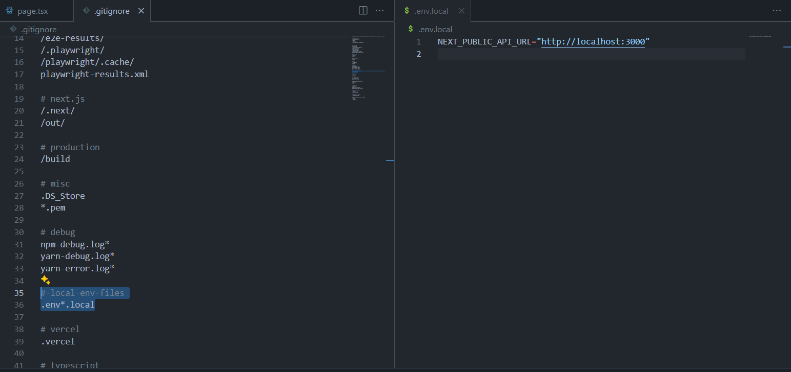

In the process of implementing the announcements page, we are using a MongoDB database and API key so that the announcements tab shows the most recent events. I have very limited knowledge of web development so this is new to me. I started by creating a .env.local ignore file to store the API. I was able to create the file but I need to do more research on how to connect the database and the tsx page via the env file and the API. 

Since I can't actually commit my env file, this is a photo of it.

